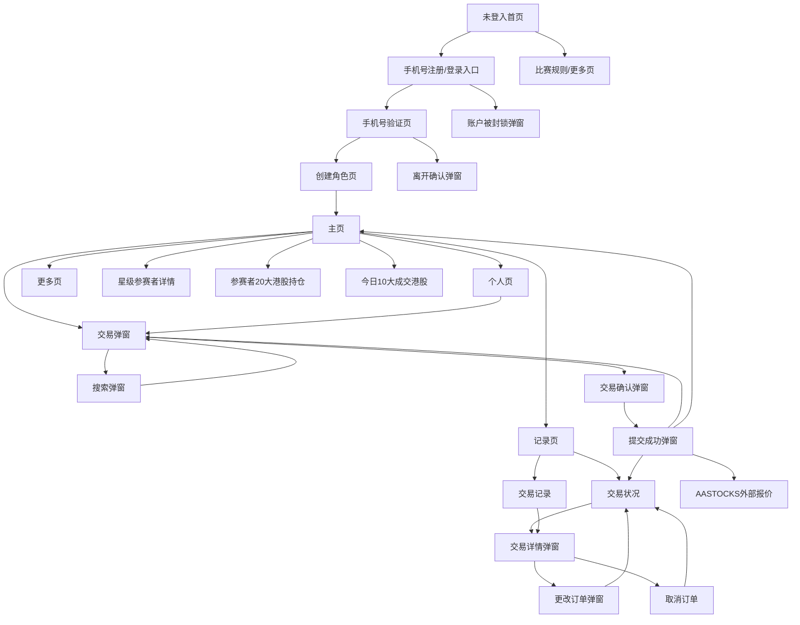

# 港股模拟交易系统产品流程与接口文档

更新时间：2026-03-28  
适用范围：`UI设计稿/` 全量图片、`PRD.md`、`前端流程及模块设计.md`、当前前后端代码

## 1. 文档目的

这份文档把 `UI设计稿/` 中的两张流程总图和各单页截图，整理成一份可以同时给产品、设计、前端、后端使用的统一说明，重点输出三部分内容：

1. 产品全流程与页面跳转关系
2. 每个页面的页面元素、功能、状态与接口依赖
3. 面向实现的 REST 接口文档，并标记当前仓库已实现与待补齐部分

注意：

- `UI设计稿/` 中残留的美股文案仅视为旧占位，落地时全部统一替换为港股语境。
- 主题色最终统一为橙色系；结构、层级、弹窗关系按设计稿保留。
- 接口设计优先按 `/api/v1/...` 输出，同时保留当前后端已有旧接口兼容说明。

## 2. 设计稿覆盖清单

本次已参考以下全部图片：

- `UI设计稿/WechatIMG3.jpg`：主流程总图 P.1
- `UI设计稿/飞书20240308-105646.jpeg`：主流程总图 P.2
- `UI设计稿/主页-上.png`
- `UI设计稿/主页-中.png`
- `UI设计稿/主页-下.png`
- `UI设计稿/个人.png`
- `UI设计稿/交易状况.png`
- `UI设计稿/交易记录.png`
- `UI设计稿/交易弹窗.png`
- `UI设计稿/搜索弹窗.png`
- `UI设计稿/交易确认和详情.png`
- `UI设计稿/交易详情和改单弹窗.png`
- `UI设计稿/10大成交.png`
- `UI设计稿/20大持仓.png`
- `UI设计稿/星级参赛者.png`

## 3. 全局流程总览



## 4. 页面信息架构与逐页说明

## 4.1 登录前链路

### 4.1.1 未登入首页

- 设计稿来源：`WechatIMG3.jpg`、`飞书20240308-105646.jpeg`
- 当前前端参考路由：`/guest`
- 页面目标：让用户快速理解活动主题、初始资金与入口动作

页面元素：

- 顶部品牌区：AASTOCKS、活动联名信息
- 活动主视觉：比赛插画、奖励氛围
- 关键信息卡：初始模拟资金 `HK$ 1,000,000`
- 主按钮：`手机号码注册 / 登录`
- 次级入口：`比赛规则`
- 次级活动点：本季奖品、影片介绍

功能：

- 跳转手机号注册/登录
- 查看比赛规则/更多说明

所需接口：

- `GET /api/v1/content/rules/summary`
- `GET /api/v1/competition/landing`

### 4.1.2 注册/登录入口页

- 设计稿来源：`飞书20240308-105646.jpeg`
- 当前前端参考路由：`/auth`
- 页面目标：承接从未登入首页进入的注册/登录启动页

页面元素：

- 关闭按钮
- 中央圆形 CTA：`手机号码注册/登录`
- 说明文案：验证手机号后创建角色并进入比赛

功能：

- 进入手机号验证页
- 关闭回到未登入首页

所需接口：

- 无强依赖，可由静态页面承接

### 4.1.3 手机号验证页

- 设计稿来源：`飞书20240308-105646.jpeg`
- 当前前端参考路由：`/auth/pin`
- 页面目标：完成手机号与验证码校验

页面元素：

- 顶部标题和关闭按钮
- 区号选择，默认 `+852`
- 手机号输入框
- 验证码输入框
- 获取验证码按钮
- 条款勾选框
- 主按钮：`下一步`
- 数字键盘

功能：

- 发送验证码
- 校验手机号 + 验证码
- 校验用户是否被封锁
- 验证通过后进入创建角色页
- 关闭时弹出离开确认

所需接口：

- `POST /api/v1/auth/sms/send`
- `POST /api/v1/auth/sms/verify`
- `GET /api/v1/auth/session`

### 4.1.4 注册中途离开确认弹窗

- 设计稿来源：`飞书20240308-105646.jpeg`
- 当前前端参考路由：`/auth/leave-confirm`

页面元素：

- 标题：确认终止登入流程
- 提示：已输入资料将不会保留
- 按钮：`取消`、`离开`

功能：

- 取消：回到手机号验证页
- 离开：回到未登入首页

所需接口：

- 无

### 4.1.5 创建角色页

- 设计稿来源：`飞书20240308-105646.jpeg`
- 当前前端参考路由：`/auth/invite`

页面元素：

- 标题：`选择头像`
- 6 个预设头像
- 上传头像入口
- 昵称输入框
- 主按钮：`确定`

功能：

- 保存头像与昵称
- 初始化比赛账户
- 完成注册后进入主页

所需接口：

- `POST /api/v1/auth/profile`
- `GET /api/v1/account/bootstrap`

### 4.1.6 账户被封锁弹窗

- 设计稿来源：`飞书20240308-105646.jpeg`
- 当前前端参考路由：`/auth/blocked`

页面元素：

- 半透明遮罩
- 违规/封锁插画
- 资格取消提示
- 按钮：`关闭`

功能：

- 阻断进入主流程
- 关闭后回到未登入页

所需接口：

- `GET /api/v1/auth/session`

## 4.2 登录后一级导航

底部固定导航共 5 个入口：

- `主页`
- `个人`
- `记录`
- `更多`
- `交易`

交互约束：

- `交易` 为中间主 CTA，应突出显示
- 登录后主要页面均保留固定底部导航
- 页面切换不应丢失当前用户上下文

## 4.3 主页

- 设计稿来源：`主页-上.png`、`主页-中.png`、`主页-下.png`、`WechatIMG3.jpg`
- 当前前端参考路由：`/`

页面元素，自上而下：

1. 顶部品牌区：AASTOCKS、分享、消息
2. 比赛条：比赛名称、赞助商
3. 赛事统计卡
   - 累计参加人数
   - 共持有资产总值
   - 赛事交易金额
   - 赛事交易次数
   - 更新时间
4. 活动/奖励 Banner
5. 当前用户资产卡
   - 头像
   - 昵称
   - 当前排名与名次变化
   - 每日可交易次数
   - 每周需交易次数
   - 起始资金
   - 额外奖励
   - 证券参考市值
   - 可投资余额
   - 资产总值
6. 星级参赛者模块
   - 顶部 tab
   - 焦点参赛者卡片
   - 投资建议摘要
   - 资产总值
   - 重仓港股
   - 最近交易
7. 参赛者 20 大港股持仓模块
8. 今日 10 大成交港股模块
9. 每周飞跃王模块
10. 排行榜模块

功能：

- 查看赛事概况
- 查看个人资产摘要
- 进入星级参赛者详情
- 进入 20 大持仓详情
- 进入 10 大成交详情
- 进入交易
- 定位当前用户在排行榜位置

所需接口：

- `GET /api/v1/home/overview`

## 4.4 个人页

- 设计稿来源：`个人.png`
- 当前前端参考路由：`/profile`

页面元素：

- 顶部品牌区
- 个人资产总览卡
  - 头像、昵称、排名、排名变化
  - 每日可交易次数 / 每周需交易次数
  - 起始资金、额外奖励
  - 证券参考市值、可投资余额、资产总值
  - 资产走势折线图
  - 更新时间
- `港股持仓` 标题区
- 币种标签：`货币（港币）`
- 持仓列表
  - 股票代码与名称
  - 持股量
  - 持股（可交易）
  - 平均价
  - 赚蚀额与赚蚀百分比
  - 现价
  - 参考市值

功能：

- 查看个人资产与走势
- 查看持仓明细
- 从持仓直接带入交易页

所需接口：

- `GET /api/v1/account/profile`
- `GET /api/v1/account/positions`
- `GET /api/v1/account/asset-trend`

## 4.5 记录页

- 设计稿来源：`交易状况.png`、`交易记录.png`
- 当前前端参考路由：`/records`

页面结构：

- 顶部一级 tab：`交易状况`、`交易记录`
- 底部保留全局导航

### 4.5.1 交易状况

页面元素：

- 次级筛选 tab：`全部`、`排队中`、`已成交`
- 币种标签
- 订单列表项
  - 股票代码 / 名称
  - 买入 / 卖出
  - 落盘价位
  - 落盘股数
  - 成交股数
  - 交易编号
  - 状态
  - 落单时间
  - 右箭头

功能：

- 查看未完结订单和当日状态
- 进入交易详情

所需接口：

- `GET /api/v1/trade/orders/active`

### 4.5.2 交易记录

页面元素：

- 日期分组
- 历史订单列表
  - 股票代码 / 名称
  - 买卖方向
  - 落盘价位
  - 落盘股数
  - 成交股数
  - 交易编号
  - 状态
  - 落单时间

功能：

- 查看历史成交与已取消记录
- 进入订单详情

所需接口：

- `GET /api/v1/trade/orders/history`

## 4.6 交易详情弹窗

- 设计稿来源：`交易详情和改单弹窗.png`
- 打开入口：记录页点击某笔订单

页面元素：

- 标题：`交易详情`
- 买入 / 卖出
- 代号
- 股数
- 已成交股数
- 落盘价
- 状态
- 交易编号
- 按钮：`更改订单`、`取消订单`、`关闭`

功能：

- 查看订单明细
- 对排队中订单执行改单
- 对排队中订单执行撤单

所需接口：

- `GET /api/v1/trade/orders/{orderId}`
- `POST /api/v1/trade/orders/{orderId}/cancel`

## 4.7 更改订单弹窗

- 设计稿来源：`交易详情和改单弹窗.png`

页面元素：

- 标题：`更改订单`
- 买入 / 卖出
- 代号
- 数量步进器
- 落盘价步进器
- 交易编号
- 按钮：`取消`、`确定`

功能：

- 修改排队中限价单
- 重跑手数、tick、±20价位、可用资金/持仓校验

所需接口：

- `POST /api/v1/trade/orders/{orderId}/amend`

## 4.8 交易页

- 设计稿来源：`WechatIMG3.jpg`、`交易弹窗.png`
- 当前前端参考路由：`/trade`

页面元素：

- 顶部品牌和关闭按钮
- 比赛信息条
- 账户信息区
  - 今日剩余交易次数
  - 可动用投资金额
- 股票搜索入口
- 当前选中股票信息
  - 股票名称
  - 股票代码
  - 实时价格
  - 涨跌额与涨跌幅
  - 跳转 AASTOCKS 报价入口
- 买卖切换：`买入` / `卖出`
- 价格输入区
  - 标题：`价格（港元）`
  - 减号 / 加号
  - 当前价格
- 数量输入区
  - 标题：`数量（股）/ 手数`
  - 减号 / 加号
  - 当前数量
  - 每手股数提示
- 预计金额区：`预计总额（含手续费）`
- 主按钮：`提交`
- 页尾备注：行情来源说明、风险提示

功能：

- 搜索股票
- 切换买卖方向
- 调整价格和数量
- 预估总额与手续费
- 提交订单
- 跳外部报价页

所需接口：

- `GET /api/v1/trade/search`
- `GET /api/v1/trade/quote/{stockCode}`
- `POST /api/v1/trade/orders/preview`

## 4.9 搜索弹窗

- 设计稿来源：`搜索弹窗.png`

页面元素：

- 搜索框
- 取消按钮
- 最近搜索股票列表
- 联想结果列表
  - 市场标识
  - 股票名称
  - 股票代码

功能：

- 支持名称、代码、拼音首字母检索
- 点击结果带回交易页

所需接口：

- `GET /api/v1/trade/search`

## 4.10 交易确认弹窗

- 设计稿来源：`交易确认和详情.png`、`飞书20240308-105646.jpeg`

页面元素：

- 标题：`确认指示`
- 买入 / 卖出
- 代号
- 股数
- 落盘价 / 委托价
- 手续费
- 预计总额
- 有效期文案
- 按钮：`更改`、`确定`

功能：

- 二次确认提交
- 根据当前时段展示有效期
  - 交易时段内：有效至本日收市
  - 非交易时段：下一交易日执行

所需接口：

- 使用 `POST /api/v1/trade/orders/preview` 返回的确认信息
- 点击确定调用 `POST /api/v1/trade/orders`

## 4.11 提交成功弹窗

- 设计稿来源：`交易确认和详情.png`、`飞书20240308-105646.jpeg`

页面元素：

- 成功图标
- 文案：`提交成功`
- 四个出口按钮
  - `查看交易状况`
  - `再次交易`
  - `跳至AASTOCKS查看报价`
  - `返回主页`

功能：

- 跳转记录页
- 回到交易页继续下单
- 打开 AASTOCKS 外链
- 返回主页

所需接口：

- 无新增接口；使用下单返回结果驱动

## 4.12 更多页

- 设计稿来源：无独立详细截图，按导航保留
- 当前前端参考路由：`/more`

页面元素建议：

- 比赛规则
- 交易说明
- 帮助中心
- 关于我们
- 联系主办方

功能：

- 承接低风险内容页

所需接口：

- `GET /api/v1/content/rules`
- `GET /api/v1/content/help`

## 4.13 星级参赛者详情页

- 设计稿来源：`星级参赛者.png`
- 当前前端参考路由：`/ranking` 或后续 ` /leaderboard/star`

页面元素：

- 返回按钮
- 标题：`星级参赛者`
- 分类 tab
- 参赛者卡片
  - 头像
  - 名称
  - 身份标签
  - 今日投资建议摘要
  - 证券参考市值
  - 可投资余额
  - 资产总值
  - 资产走势折线图
- 持仓区
  - 标题：`港股持仓 - {参赛者}`
  - 币种标签
  - 持仓列表

功能：

- 切换不同星级参赛者
- 浏览其持仓与建议

所需接口：

- `GET /api/v1/leaderboard/star-traders`

## 4.14 参赛者 20 大港股持仓详情页

- 设计稿来源：`20大持仓.png`
- 当前前端参考路由：`/market/top-holdings`

页面元素：

- 返回按钮
- 标题：`参赛者20大港股持仓`
- 表头
  - 代号及名称
  - 持仓总额 / 变动
- 榜单列表
- 更新时间

功能：

- 查看前 20 大港股持仓榜
- 点击股票带入交易页

所需接口：

- `GET /api/v1/leaderboard/top-holdings`

## 4.15 今日 10 大成交港股详情页

- 设计稿来源：`10大成交.png`
- 当前前端参考路由：`/market/top-volume`

页面元素：

- 返回按钮
- 标题：`今日10大成交港股`
- 顶部 tab：`10大买入`、`10大卖出`
- 表头
  - 代号及名称
  - 总买入金额 / 总卖出金额
- 榜单列表
- 更新时间

功能：

- 切换买入 / 卖出榜
- 点击股票回流交易页

所需接口：

- `GET /api/v1/leaderboard/top-turnover`

## 5. 页面状态与业务拦截要求

所有关键页面至少覆盖 4 种状态：

- `loading`
- `empty`
- `error`
- `success`

高优先级拦截场景：

- 非白名单股票禁止交易
- 停牌股票禁止新下单
- 非交易时段禁止市价单
- 买入达到当日 20 笔上限
- 排队中限价单达到 5 笔上限
- 非手数倍数
- 限价超出按盘价上下 20 个价位
- 买入价低于 `HK$0.05`
- 卖出价低于 `HK$0.01`
- 可用资金不足
- 可卖持仓不足

## 6. 接口设计总原则

### 6.1 返回结构

内部接口统一使用：

```json
{
  "code": 200,
  "msg": "success",
  "data": {}
}
```

### 6.2 枚举定义

```ts
type TradeSide = "BUY" | "SELL";
type OrderType = "LIMIT" | "MARKET";
type OrderStatus =
  | "PENDING"
  | "PARTIAL_FILLED"
  | "FILLED"
  | "CANCELED"
  | "REJECTED";
type AccountStatus = "ACTIVE" | "BLOCKED";
```

### 6.3 通用字段

```ts
type QuoteSnapshot = {
  stockCode: string;
  stockName: string;
  market: "HK";
  nominalPrice: number;
  changeAmount: number;
  changePercent: number;
  prevClose: number;
  lotSize: number;
  suspended: boolean;
  updatedAt: string;
};
```

## 7. 接口文档

## 7.1 认证与用户

### 7.1.1 发送短信验证码

- Method：`POST`
- Path：`/api/v1/auth/sms/send`
- 用途：手机号验证页发送验证码

请求：

```json
{
  "mobileAreaCode": "+852",
  "mobile": "91234567"
}
```

响应：

```json
{
  "code": 200,
  "msg": "验证码已发送",
  "data": {
    "requestId": "sms_123456",
    "expireInSeconds": 60
  }
}
```

### 7.1.2 验证短信并登录/注册

- Method：`POST`
- Path：`/api/v1/auth/sms/verify`
- 用途：校验验证码并返回会话状态

请求：

```json
{
  "mobileAreaCode": "+852",
  "mobile": "91234567",
  "verifyCode": "284212"
}
```

响应：

```json
{
  "code": 200,
  "msg": "success",
  "data": {
    "token": "jwt-or-session-token",
    "userId": "u_10001",
    "isNewUser": true,
    "accountStatus": "ACTIVE",
    "nextStep": "PROFILE_SETUP"
  }
}
```

### 7.1.3 获取当前会话

- Method：`GET`
- Path：`/api/v1/auth/session`
- 用途：验证登录态、判断是否封锁、决定跳转页

响应：

```json
{
  "code": 200,
  "msg": "success",
  "data": {
    "loggedIn": true,
    "userId": "u_10001",
    "mobile": "91234567",
    "accountStatus": "ACTIVE",
    "profileCompleted": true
  }
}
```

### 7.1.4 创建/更新角色资料

- Method：`POST`
- Path：`/api/v1/auth/profile`
- 用途：创建头像和昵称

请求：

```json
{
  "avatarType": "PRESET",
  "avatarValue": "avatar_01",
  "nickname": "Joey Cheung"
}
```

响应：

```json
{
  "code": 200,
  "msg": "角色创建成功",
  "data": {
    "userId": "u_10001",
    "profileCompleted": true,
    "redirectTo": "/"
  }
}
```

## 7.2 首页与资产

### 7.2.1 首页总览

- Method：`GET`
- Path：`/api/v1/home/overview`
- 用途：主页一次性拉取主要模块数据

响应：

```json
{
  "code": 200,
  "msg": "success",
  "data": {
    "competition": {
      "name": "智财港股投资大赛2026",
      "sponsor": "Citi",
      "currency": "HKD",
      "updatedAt": "2026-03-28T16:00:00+08:00"
    },
    "eventStats": {
      "participantCount": 223563,
      "holdingAssetValue": 9562000000,
      "tradingAmount": 1105153,
      "tradingCount": 151586
    },
    "banner": {
      "title": "想赚取 HK$500,000 模拟交易资金？",
      "ctaText": "查看详情",
      "linkType": "RULES"
    },
    "mySummary": {
      "userId": "u_10001",
      "nickname": "Joey Cheung",
      "avatar": "https://...",
      "rank": 91,
      "rankDelta": 12,
      "dailyTradesRemaining": 16,
      "weeklyTradesRequired": 4,
      "weeklyTradesRemaining": 2,
      "initialCapital": 1000000,
      "bonusAmount": 50000,
      "securitiesMarketValue": 513910,
      "cashAvailable": 379562.1,
      "totalAssets": 947321.64
    },
    "starParticipant": {
      "tabs": ["青姐", "沈大师", "英sir"],
      "featuredTab": "青姐",
      "name": "青姐",
      "tag": "独立股评人",
      "advice": "今日关注港股科技与高息 ETF 配置节奏",
      "totalAssets": 1656735,
      "topHolding": "00700 腾讯控股",
      "recentTrade": "买入 02800 盈富基金"
    },
    "topHoldingsBubble": [
      { "rank": 1, "stockCode": "00700", "stockName": "腾讯控股", "holdingValue": 2250000000 }
    ],
    "topTurnoverSnapshot": {
      "topBuy": { "stockCode": "00700", "stockName": "腾讯控股", "amount": 202600 },
      "topSell": { "stockCode": "02800", "stockName": "盈富基金", "amount": 181000 }
    },
    "weeklyFlyer": {
      "period": "2026/03/23 至 2026/03/27",
      "winnerName": "Kit Chu",
      "assetGrowthPercent": 93,
      "rankRise": 10183
    },
    "ranking": [
      {
        "rank": 1,
        "rankMovement": "SAME",
        "nickname": "Mary Lee",
        "totalAssets": 3228531,
        "changePercent": 93
      }
    ]
  }
}
```

### 7.2.2 账户资产摘要

- Method：`GET`
- Path：`/api/v1/account/profile`
- 用途：个人页顶部总览卡

### 7.2.3 资产走势

- Method：`GET`
- Path：`/api/v1/account/asset-trend`
- Query：`range=7d|30d`
- 用途：个人页和星级参赛者页折线图

### 7.2.4 当前持仓

- Method：`GET`
- Path：`/api/v1/account/positions`
- 用途：个人页持仓列表

响应 `data`：

```json
{
  "currency": "HKD",
  "updatedAt": "2026-03-28T16:00:00+08:00",
  "items": [
    {
      "stockCode": "00700",
      "stockName": "腾讯控股",
      "quantity": 1000,
      "tradableQuantity": 1000,
      "averagePrice": 323.4,
      "currentPrice": 333.4,
      "pnlAmount": 10000,
      "pnlPercent": 3.09,
      "referenceMarketValue": 333400
    }
  ]
}
```

## 7.3 榜单与资讯

### 7.3.1 星级参赛者

- Method：`GET`
- Path：`/api/v1/leaderboard/star-traders`
- Query：`tab=青姐`

### 7.3.2 20 大港股持仓

- Method：`GET`
- Path：`/api/v1/leaderboard/top-holdings`
- Query：`limit=20`

### 7.3.3 10 大成交港股

- Method：`GET`
- Path：`/api/v1/leaderboard/top-turnover`
- Query：`side=BUY|SELL&limit=10`

### 7.3.4 排行榜

- Method：`GET`
- Path：`/api/v1/leaderboard/rankings`
- Query：`page=1&pageSize=50`

## 7.4 交易行情与搜索

### 7.4.1 股票搜索

- Method：`GET`
- Path：`/api/v1/trade/search`
- Query：`keyword=腾讯`
- 用途：交易搜索弹窗、联想结果、最近搜索融合

响应：

```json
{
  "code": 200,
  "msg": "success",
  "data": {
    "recent": [
      { "stockCode": "00700", "stockName": "腾讯控股", "market": "HK" }
    ],
    "suggestions": [
      { "stockCode": "00700", "stockName": "腾讯控股", "market": "HK", "lotSize": 100 }
    ]
  }
}
```

### 7.4.2 获取单只股票行情

- Method：`GET`
- Path：`/api/v1/trade/quote/{stockCode}`
- 用途：交易页选中股票后加载实时信息

响应：

```json
{
  "code": 200,
  "msg": "success",
  "data": {
    "stockCode": "00700",
    "stockName": "腾讯控股",
    "market": "HK",
    "nominalPrice": 323.4,
    "changeAmount": 5.2,
    "changePercent": 1.63,
    "prevClose": 318.2,
    "lotSize": 100,
    "tickSize": 0.2,
    "suspended": false,
    "allowTrade": true,
    "quoteUrl": "https://www.aastocks.com/...",
    "updatedAt": "2026-03-28T15:58:30+08:00"
  }
}
```

### 7.4.3 订单预校验与费用预览

- Method：`POST`
- Path：`/api/v1/trade/orders/preview`
- 用途：交易页实时展示预计金额、确认弹窗信息

请求：

```json
{
  "stockCode": "00700",
  "direction": "BUY",
  "orderType": "LIMIT",
  "price": 323.4,
  "quantity": 100
}
```

响应：

```json
{
  "code": 200,
  "msg": "success",
  "data": {
    "stockCode": "00700",
    "stockName": "腾讯控股",
    "direction": "BUY",
    "orderType": "LIMIT",
    "price": 323.4,
    "quantity": 100,
    "lotSize": 100,
    "nominalPrice": 323.2,
    "tickSize": 0.2,
    "feeBreakdown": {
      "brokerageCommission": 100,
      "transactionLevy": 0.97,
      "tradingFee": 1.62,
      "stampDuty": 32.34,
      "processingFee": 30
    },
    "estimatedTotalAmount": 32493.93,
    "validityLabel": "交易指示有效至本日收市",
    "dailyBuyRemaining": 16,
    "activeLimitOrderRemaining": 3
  }
}
```

## 7.5 交易订单

### 7.5.1 提交订单

- Method：`POST`
- Path：`/api/v1/trade/orders`
- 用途：确认弹窗点击确定后正式提交

请求：

```json
{
  "stockCode": "00700",
  "direction": "BUY",
  "orderType": "LIMIT",
  "price": 323.4,
  "quantity": 100
}
```

响应：

```json
{
  "code": 200,
  "msg": "提交成功",
  "data": {
    "orderId": "ord_202603280001",
    "status": "PENDING",
    "successActions": [
      "VIEW_ACTIVE_ORDERS",
      "TRADE_AGAIN",
      "OPEN_QUOTE",
      "BACK_HOME"
    ]
  }
}
```

### 7.5.2 当前交易状况列表

- Method：`GET`
- Path：`/api/v1/trade/orders/active`
- Query：`status=ALL|PENDING|FILLED`

### 7.5.3 历史交易记录

- Method：`GET`
- Path：`/api/v1/trade/orders/history`
- Query：`page=1&pageSize=20&dateFrom=2026-03-01&dateTo=2026-03-28`

### 7.5.4 订单详情

- Method：`GET`
- Path：`/api/v1/trade/orders/{orderId}`

响应：

```json
{
  "code": 200,
  "msg": "success",
  "data": {
    "orderId": "ord_202603280001",
    "stockCode": "00700",
    "stockName": "腾讯控股",
    "direction": "BUY",
    "orderType": "LIMIT",
    "price": 323.4,
    "quantity": 100,
    "filledQuantity": 0,
    "filledAvgPrice": 0,
    "status": "PENDING",
    "feeAmount": 164.93,
    "createdAt": "2026-03-28T15:59:00+08:00",
    "canAmend": true,
    "canCancel": true
  }
}
```

### 7.5.5 更改订单

- Method：`POST`
- Path：`/api/v1/trade/orders/{orderId}/amend`
- 用途：更改排队中的限价单

请求：

```json
{
  "price": 323.6,
  "quantity": 200
}
```

### 7.5.6 取消订单

- Method：`POST`
- Path：`/api/v1/trade/orders/{orderId}/cancel`

响应：

```json
{
  "code": 200,
  "msg": "订单已取消",
  "data": {
    "orderId": "ord_202603280001",
    "status": "CANCELED",
    "releasedCash": 32493.93,
    "releasedQuantity": 0
  }
}
```

## 7.6 内容页

### 7.6.1 比赛规则

- Method：`GET`
- Path：`/api/v1/content/rules`

### 7.6.2 帮助中心

- Method：`GET`
- Path：`/api/v1/content/help`

## 8. 错误码建议

| code | 场景 | 提示文案 |
| --- | --- | --- |
| 200 | 成功 | success |
| 40001 | 参数错误 | 请求参数不完整或格式错误 |
| 40002 | 非白名单股票 | 当前比赛仅支持指定港股及 ETF |
| 40003 | 停牌限制 | 停牌期间只可取消未成交挂单 |
| 40004 | 非交易时段市价单 | 非交易时段不可提交市价盘 |
| 40005 | 买入次数超限 | 已超过单日 20 笔买入上限 |
| 40006 | 排队限价单超限 | 已超过 5 笔排队中限价单上限 |
| 40007 | 非手数倍数 | 下单数量必须为每手股数的整数倍 |
| 40008 | 超出 ±20 价位 | 限价须落在当前按盘价上下 20 个价位内 |
| 40009 | 价格低于底线 | 买入价不得低于 HK$0.05，卖出价不得低于 HK$0.01 |
| 40010 | 资金不足 | 可用资金不足，金额需包含手续费 |
| 40011 | 持仓不足 | 可卖持仓不足 |
| 40012 | 订单不可改单 | 当前订单状态不允许更改 |
| 40013 | 订单不可撤销 | 当前订单状态不允许取消 |
| 40101 | 未登录 | 登录状态已失效，请重新登录 |
| 40301 | 账户封锁 | 抱歉，您的比赛资格已被取消 |
| 40401 | 订单不存在 | 未找到对应订单 |
| 50000 | 系统异常 | 系统繁忙，请稍后重试 |

## 9. 当前代码实现映射与差距

### 9.1 当前已存在能力

- 前端已具备的主要页面：
  - `/`
  - `/guest`
  - `/auth`
  - `/auth/pin`
  - `/auth/leave-confirm`
  - `/auth/invite`
  - `/auth/blocked`
  - `/profile`
  - `/records`
  - `/more`
  - `/trade`
  - `/market/top-holdings`
  - `/market/top-volume`
- 当前后端已存在接口：
  - `POST /api/orders/place`

### 9.2 当前后端旧接口字段

当前代码中的下单接口请求体为：

```json
{
  "userId": "demo-user",
  "stockCode": "00700",
  "type": 1,
  "price": 323.4,
  "quantity": 100
}
```

字段说明：

- `type=1` 表示买入
- `type=2` 表示卖出
- 当前未显式支持 `orderType`
- 当前前端 `frontend/lib/api/trade.ts` 直接调用旧路径 `/api/orders/place`

### 9.3 建议兼容策略

- 对外目标接口统一收敛为 `POST /api/v1/trade/orders`
- 旧接口 `POST /api/orders/place` 在过渡期保留兼容
- 服务端内部完成字段映射：
  - `direction=BUY -> type=1`
  - `direction=SELL -> type=2`
- 在后端补齐：
  - `orderType`
  - 预览接口
  - 查询交易状况 / 历史 / 详情
  - 改单 / 撤单
  - 账户资产与榜单查询接口

## 10. 推荐落地顺序

1. 先补首页、个人页、记录页、榜单页的只读接口
2. 再补交易搜索、行情、预览接口，让交易弹窗从 mock 数据切到真实接口
3. 最后补改单、撤单、交易详情与完整记录链路

## 11. 结论

从设计稿看，这个产品不是单纯的“交易页 + 排行榜”，而是一条完整的比赛活动链路，核心闭环为：

- 登录/注册入场
- 首页承接赛事内容与榜单
- 交易页作为主 CTA 完成下单
- 记录页承接订单状态、详情、改单、撤单
- 个人页承接资产和港股持仓

接口设计上，建议以“页面消费模型”组织接口，而不是仅以底层订单表结构组织接口。这样前端能直接按页面模块取数，后端也更容易在保持统一返回结构 `Result<T>` 的同时逐步兼容现有实现。
